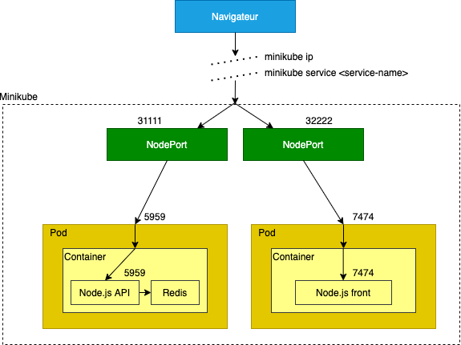
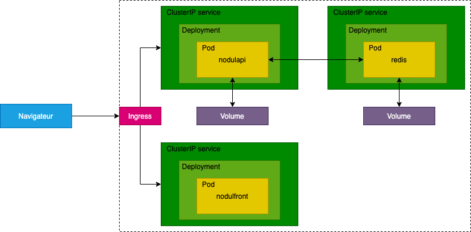

[[_TOC_]]

# Nodul app

2 parties :

- dossier `app` : contient l'application, sans aucun lien avec la partie déploiement
- dossier `deploy` : uniquement la partie déploiement, sans aucun lien avec l'application

## Description

L'application s'apelle `nodulapp`, elle contient plusieurs composants :

- `nodulapi` : l'API exposée
- `nodulfront` : le frontend
- `nodulmongo` : le serveur MongoDB en tant que base de données

L'application démarre une API qui expose une seule route et un front qui affiche une seule page. Cette page affiche des informations :

- le numéro de version du front et de l'api
- les infos de l'api sont :
  - une variable d'environnement `NODUL_FOO` qui peut être définie
  - la liste des fichiers se trouvant dans le dossier temporaire de la machine
  - la liste des documents du serveur MongoDB associé (si la variable d'environnement est spécifiée - voir ci-après)

A chaque visite sur la page, un nouveau fichier est créé (et un nouveau document ajouté à MongoDB si utilisé).

Les serveurs écoutent par défaut :

- sur le port 3000 pour l'api
- sur le port 4000 pour le front

Il est possible de modifier le port avec les variables d'environnement

- `NODUL_API_PORT`
- `NODUL_FRONT_PORT`

Si MongoDB est utilisé, l'application se connecte par défaut sur `127.0.0.1:27017`. Il est possible de modifier :

- le host avec `NODUL_MONGO_HOST`
- le port avec `NODUL_MONGO_PORT`

Le frontend va appeler l'api par défaut sur `localhost:3000`. Ceci peut être modifié avec `NODUL_API_URL`.

On va essayer de déployer la même applicaiton avec :

- Node.js
- Docker en ligne de commande
- Docker compose
- Kubernetes

## Lancement à la mano

- `npm i --prefix app`
- `node app/src/api.js`
- `node app/src/front.js` (autre terminal)

> Dans ce cas, le serveur MongoDB n'est pas utilisé.

Se rendre sur http://localhost:3000.

## Avec docker en ligne de commande

> En mode impératif

Des scripts sont créés pour faciliter les commandes :

- Builder les images : `sh deploy/docker/build.sh`
- Démarrer les containers : `sh deploy/docker/run.sh`
- Tout supprimer : `sh deploy/docker/clean.sh`

> Dans ce cas, le serveur MongoDB pas utilisé.

Une fois les containers démarrés, se rendre sur :

- http://localhost:8585 pour l'api
- http://localhost:8090 pour le front

Le dossier temporaire utilisé par l'application est monté dans `data/file` afin de persister les fichiers créés. Le dossier de données de MongoDB est quant à lui monté dans `data/mongodb`.

### Logs

- API : `docker logs -f nodulapi`
- Front : `docker logs -f nodulfront`

### Publier le images

#### Sur Docker Hub

- `sh deploy/docker/tag-images.sh`
- `sh deploy/docker/publish-images.sh`

On peut ensuite récupérer ces images depuis Dockerhub :

- `docker pull dnrjpc/nodulapi:1`
- `docker pull dnrjpc/nodulfront:1`

#### En local

Si on ne souhaite pas utiliser DockerHub :

- `eval $(minikube docker-env)` : le terminal courant est désormais branché à Docker dans minikube
- `sh deploy/docker/build.sh`
- `sh deploy/docker/tag-images.sh`
- on peut vérifier que tout est ok avec `docker images | grep nodul`
- penser à indiquer `imagePullPolicy: Never` dans les fichiers YAML de Kubernetes

https://stackoverflow.com/a/42564211

> Attention, seul le terminal courant est concerné par cela. Pour revenir en arrière et se rebancher à Docker local : `eval $(minikube docker-env -u)`

## Avec docker compose

> En mode déclaratif

- Démarrer l'application : `docker compose --project-directory deploy/docker-compose up`
- Stopper l'application : `docker compose --project-directory deploy/docker-compose down` (les containers sont supprimés)
- Reconstruire les images : `docker compose --project-directory deploy/docker-compose build`

Idem docker en ligne de commande pour le reste.

- Nettoyer :
  - `docker rmi docker-compose_nodulfront`
  - `docker rmi docker-compose_nodulapi`

## Avec Kubernetes

Démarrer minikube :

- si minikube avec driver Docker
  - `minikube config set driver docker`
- sinon
  - `minikube config set driver virtualbox`
- `minikube start`

### Pod + NodePort

Juste pour le fun, ne pas faire en prod. les deux containers sont regroupés dans 1 seul pod.

Schéma :

- `kubectl apply -f deploy/k8s/without-deployment`
- si minikube avec driver Docker
  - `minikube service nodulfront-nodeport`
  - le navigateur s'ouvre sur l'URL affichée
- sinon
  - `minikube ip`
  - API : `http://<minikube-ip>:31111`
  - Front : `http://<minikube-ip>:32222`
- `kubectl get pods`
  - `nodulapi-pod` : `READY -> 3/3` : on a bien 2 containers dans notre pod "API"
- `kubectl logs -f nodulapi-pod nodulapi` pour voir les logs de l'app Node.js API
- `kubectl logs -f nodulapi-pod nodulmongo` pour voir les logs de MongoDB
- `kubectl logs -f nodulfront-pod` pour voir les logs de l'app Node.js front

**TODO : comment indiquer au front l'URL de l'API (qui doit être une URL externe du coup) ? Aujourd'hui on met simplement 127.0.0.1 mais comment connaitre l'adresse IP ? Si on expose avec un nom DNS on peut directement le mettre mais sinon ?**

- `kubectl delete -f deploy/k8s/without-deployment` pour nettoyer

> Si on modifie le code source de l'application (API ou front), il faudra publier à nouveau les images (voir plus haut)

### Deployment

Installer Ingress :

- facile avec minikube :
  - `minikube addons enable ingress`

Schéma :

- `kubectl apply -f deploy/k8s/with-deployment`
- `kubectl get all -l app=nodulapp` pour voir tous les objets créés (sauf les PVC et Ingress)
- `kubectl get pvc -l app=nodulapp` pour voir les PVC
- `kubectl get ingresses -l app=nodulapp` pour voir les PVC
- si minikube avec driver Docker
  - `minikube service nodulapi-clusterip` (spécifique minikube)
  - le navigateur s'ouvre sur l'URL affichée
- sinon
  - `minikube ip`
  - API : http://<minikube-ip>/api
  - Front http://<minikube-ip>
- `kubectl get pods -l app=nodulapp` pour voir les pods créés
- `kubectl logs -f nodulapi-deployment-xxx-yyy` pour voir les logs de l'app Node.js API
- `kubectl logs -f nodulmongo-deployment-xxx-yyy` pour voir les logs de MongoDB
- `kubectl logs -f nodulfront-deployment-xxx-yyy` pour voir les logs de l'app Node.js front

**TODO : comment indiquer au front l'URL de l'API (qui doit être une URL externe du coup) ? Aujourd'hui on met simplement 127.0.0.1 mais comment connaitre l'adresse IP ? Si on expose avec un nom DNS on peut directement le mettre mais sinon ?**

Après une modification des fichiers YAML : `kubectl apply -f deploy/k8s/with-deployment` pour mettre à jour

Redémarrer les déploiements :

- `kubectl rollout restart deployment nodulapi-deployment`
- `kubectl rollout restart deployment nodulmongo-deployment`
- `kubectl rollout restart deployment nodulfront-deployment`
- si minikube avec driver Docker
  - `minikube service nodulapi-clusterip` (spécifique minikube)
  - Les fichiers et les valeurs MongoDB sont toujours présents
- sinon
  - `minikube ip`
  - http://<minikube-ip>

Pour tout supprimer :

- `kubectl delete -f deploy/k8s/with-deployment`
- ou
  - `kubectl delete all -l app=nodulapp`
  - `kubectl delete pvc -l app=nodulapp` (les fichiers crées et les données de MongoDB seront perdues)
  - `kubectl delete ingress -l app=nodulapp`

Debugger un pod qui ne démarre pas :

- `kubectl describe pod <podname>`

> Si on modifie le code source de l'application (API ou front), il faudra publier à nouveau les images (voir plus haut)

### Resources

- Kubernetes
  - https://kubernetes.io/docs/reference
  - YAML spec : https://kubernetes.io/docs/reference/generated/kubernetes-api/v1.21
  - https://matthewpalmer.net/kubernetes-app-developer/articles/kubernetes-ports-targetport-nodeport-service.html
  - https://kubernetes.io/docs/concepts/overview/working-with-objects/common-labels
- Kubectl
  - Commandes https://kubernetes.io/docs/reference/generated/kubectl/kubectl-commands
- Minikube
  - https://minikube.sigs.k8s.io/docs/drivers/docker
  - https://minikube.sigs.k8s.io/docs/handbook/accessing/#nodeport-access

Avec minikube, voir les containers créés en sous-jacent :

- driver Docker
  - `docker exec -it minikube bash`
  - `docker ps -a | grep nodulapp`
- driver VirtualBox

Ingress ATTENTION :

- Ingress community (ingress-nginx)
  - github.com/kubernetes/ingress-nginx
  - https://kubernetes.github.io/ingress-nginx
- Ingress Nginx propriétaire (kubernetes-ingress)
  - github.com/nginxinc/kubernetes-ingress

-> on utilise bien ingress community et pas la version propriétaire !

### Troubleshoot

Si on souhaite forcer le re-pull d'une image qui a déjà été pull (par exemple si on republie sur DockerHub une image mise à jour avec le même tag), décommenter `imagePullPolicy: Always` (attention à ne pas trop le faire à cause des limites imposées par Docker Hub https://www.docker.com/increase-rate-limits)

### TODO

- ajouter un namespace
- load balancing
- mise à jour docker hub image
- utiliser des secrets (login/pwd pour accéder à MongoDB)
- utiliser un fichier de config qu'on va injecter
